Overvoltage
===========

This is a software sampler plugin. The old  freeware plugin shortcircuit2 (or sc2) has been the big role model because of its ease of use and creativity-inducing audio-sculpting functions. Unfortunately, sc2 hasn't been updated for quite a long time and is only available as a 32bit VST2 plugin. This and the fact that I always wanted to develop my own instrument plugin as a learning excercise are the reasons why I started Overvoltage.

**Note:**

*The current state of Overvoltage should be considered highly experimental, unstable, incomplete and hence far from ready to be used in a productive manner.*

## Copyright & License

Overvoltage is free software and licensed under GPL-3.0.

Copyright (c) 2024 by Christian Nowak a.k.a. chn

## Cloning from git

    git clone https://github.com/chn-dev/Overvoltage
    cd Overvoltage
    git submodule update --init --recursive

The last step is necessary because the JUCE repository is included as a submodule in ./Overvoltage/JUCE/. The "git submodule update" command automatically clones the right version of JUCE to that directory.

## Compiling

### Linux

    cmake . -B build
    cmake --build build

### Windows

    cmake . -B build -DLIBXML2_LIBRARY="C:\Program Files\libxml2\lib\libxml2s.lib" -DLIBXML2_INCLUDE_DIR="C:\Program Files\libxml2\include\libxml2"
    cmake --build build

Overvoltage depends on libxml2 for loading/saving its data, so libxml2 needs to be compiled and installed under Windows before compiling Overvoltage. The variables LIBXML2_LIBRARY and LIBXML2_INCLUDE_DIR tell cmake where to find the library file and the header files of libxml2.

Depending on libxml2 rather than the internal XML framework of JUCE is a design decision to achieve a strict separation between the sampler's GUI (src/SamplerGUI), the sampler engine (src/SamplerEngine) and the interfacing with the plugin's host using the LV2, VST3 or any other interface specification (JUCE). This way, the SamplerEngine can be used in isolation to just play music in a game, for example. In that case, the dependency on JUCE can be omitted and only the dependency on libxml2 remains.

## Overview

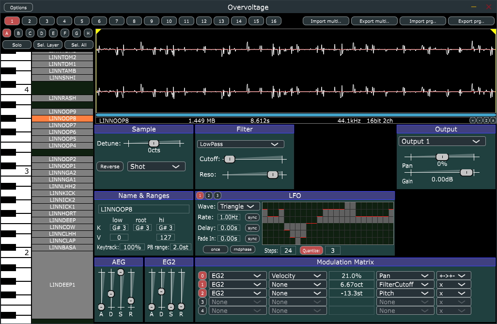

An instance of Overvoltage consists of a program containing 16 parts (which correspond to MIDI channels 1 to 16). Each part consists of 8 layers A..H, each containing an arbitrary number of samples. You can drag&drop WAV files from your operating system's file explorer to Overvoltage's sample area located right beside the keybard area. Each block in the sample area corresponds to a sample. You can activate sample(s) by clicking on them (while optionally holding the Ctrl key) or by marking them with a selection rectangle. 

### Buttons at the Top Edge of the Plugin Window

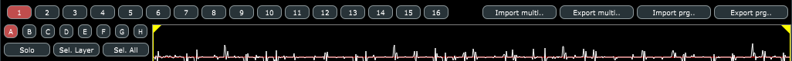

 - 1..16: Part selection
 - A..H: Layer selection for the current part
 - Solo: Only the currently selected samples can be played
 - Sel. Layer: Select all samples within the currently selected layer
 - Sel. All: Select all samples within the currently selected part
 - Import multi: Import a complete multi-program from an XML file
 - Export multi: Export a complete multi-program to an XML file
 - Import prg: Import a single program from an XML file
 - Export prg: Export a single program to an XML file

### The Piano Roll and Sample Area

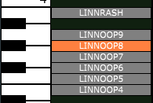

You can scroll the piano roll/sample area up and down with the mouse wheel. A note can be played by clicking on a key.

Each block in the sample area represents a sample. You can select samples by clicking on them. If you press the Ctrl key while clicking on samples or use the selection rectangle, more than one sample can be selected at the same time. Selected samples can be dragged up and down with the mouse.

A block's vertical dimension represents the pitches and the horizontal dimension the velocities it covers. You can drag the edges of each block to change the pitch and velocity coverage.

### The Waveform Area

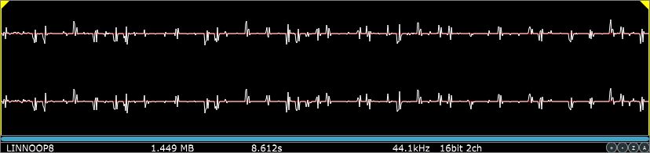

The waveform area has most of the functionality you'd expect from a wave editor program like Audacity or Wavelab:

  - Drag the yellow loop start and end markers
  - Mark a portion of the waveform
  - Zoom in by clicking the "+" button
  - Zoom out by clicking the "-" button
  - Zoom into the marked portion of the waveform by clicking the "Z" button
  - Zoom out completely to show the complete waveform by clicking the "A" button
  - Scroll the waveform left and right by dragging the blue scrollbar at the bottom

### The Sample Settings Area

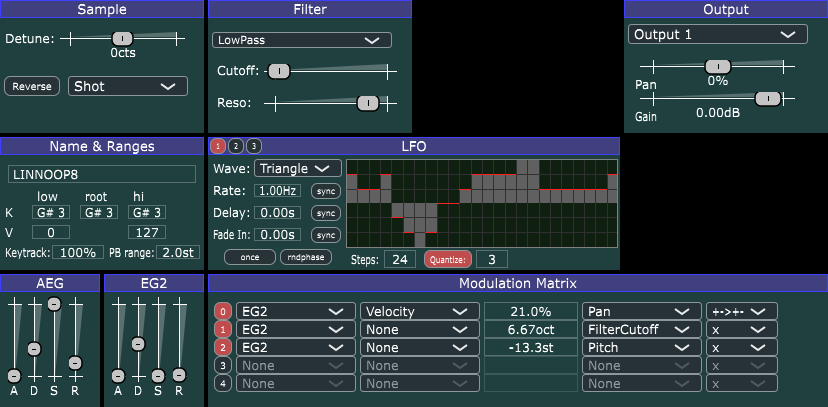

Here you can view and change all the settings of the currently selected sample(s). Most of them should be self-explanatory, so I'll explain just the few that might actually need explanation.

#### Sample

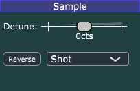

 - Detune from -100 cents to +100 cents (i.e.: -1 .. +1 semitone)
 - Reverse: The sample is played backwards
 - Playmode
    - Standard: Sample playback (without looping) is stopped when its end has been reached or the AEG has ended.
    - Loop: The looped sample playback is stopped when the AEG has ended.
    - Shot: Play the complete sample from start to finish without looping it.
    - LoopUntilRelease: Sample playback is looped and stopped when the keyboard key is released.

#### Name & Ranges

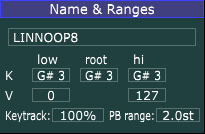

 - **K**ey low and high are the lowest and highest note
 - **V**elocity low and high are the lowest and highest velocity the sample responds to when a MIDI note on message is received
 - The root key is the note where the sample is played at normal speed
 - PB (pitchbend) range defines the limits (in semitones) within which the pitch is affected by the pitchbend wheel.
 - Keytrack: Defines the proportion of sample playback frequency to the MIDI note. 100% means that moving up one semitone on the keyboard increases the playback speed by one semitone. 200% means that moving up one semitone on the keyboard increases the playback speed by two semitones.

#### AEG / EG2

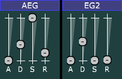

Should be self-explanatory.

#### Filter

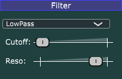

For now, there are three selectable types:

 - None
 - LowPass
 - HighPass

When LowPass or HighPass is selected, the Cutoff and Resonance parameters can be applied.

#### LFO

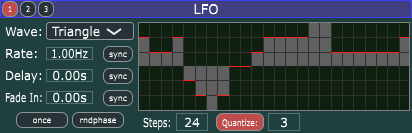

Each of the 3 LFOs has the following settings:

 - Wave(form): Triangle, Pulse, Rectangle, Sawtooth, Random or Custom
 - Rate in Hz (sync disabled) or in beats (sync enabled)
 - Delay in seconds (sync disabled) or in beats (sync enabled)
 - Fade In in seconds( sync disabled) or in beats (sync enabled)
 - Once: Only one cycle of the the LFO's waveform is used
 - Rndphase (Random Phase): The start phase of the waveform is randomized with each note trigger

On the right hand side the settings of the custom waveform can be found:

 - In the waveform display, you can set each step's value with the mouse
 - Steps: The number of steps
 - Quantize: If enabled, selects the number of different values above and below the 0-line

#### Modulation Matrix

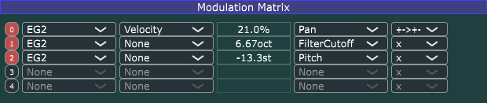

Each row represents one of the 5 modulation slots. Each of the 6 columns has the following meaning:

 - Number of the modulation slot: click to switch it on/off
 - Modulation Source
 - Modificator: is multiplicated with the modulation source's value)
 - Modulation Amount: the unit depends on the modulation destination
 - Modulation Destination
 - Mathematical Function for modifying the resulting value

Modulation sources:

 - AEG
 - EG2
 - Velocity
 - Absolute Note
 - Relative Note
 - LFO1-3
 - Modulation Wheel
 - Random Value (Unipolar)
 - Random Value (Bipolar)
 - Gate (this is 1 as long as the keyboard key is pressed and 0 when not)
 - IsWithinLoop (1 as long as the current playing position of the sample is within the loop boundaries)

Modulation destinations:

 - Filter Cutoff (in octaves)
 - Filter Resonance (in %)
 - Pitch (in semitones)
 - Pan (in %)
 - Amp (in %)

Mathematical functions:

 - "x": Neutral
 - "1-x"
 - "+-->+": Bipolar to unipolar
 - "+->+-": Unipolar to bipolar
 - "x^2": Squared
 - "x^3": Cubed
 - "abs": Absolute value
 - "-x": Negative x

#### Output

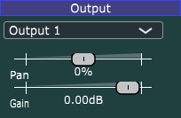

Overvoltage has 8 separate stereo output channels. So for seach sample, you can select one of them. Otherwise, you can change:

 - Pan (-100% = left, +100% = right)
 - Gain (in relative dB)

## That's it!

If you have any questions, comments, suggestions or just wanna say hi, feel free to contact me.

Christian Nowak a.k.a. chn <[chnowak@web.de](mailto:chnowak@web.de)>

[https://mastodon.art/@chn/](https://mastodon.art/@chn/)
